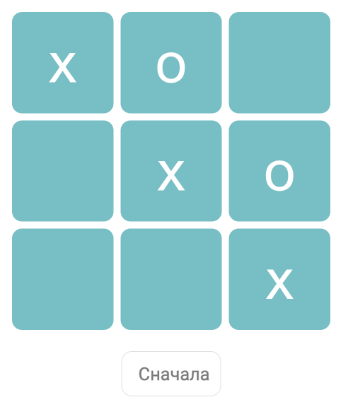

# Дипломная работа по курсу «Основы программирования»

В качестве дипломной работы нужно запрограммировать игру «крестики-нолики». Фронтенд-разработчик подготовил для вас визуальное оформление, осталось написать логику работы игры.

Игроки по очереди ставят крестики и нолики. Игрок, первый заполнивший диагональ, вертикаль или горизонталь своими символами, выигрывает.

[Стартовый код для реализации проекта](https://repl.it/@netology_pb/Diplom-startovyi-kod). Страница отобржается во вкладке **result**, отладочная информация во вкладке **console**.



## Из чего состоит проект?

Проект состоит из пустого файла `logic.js` в котором нужно реализовать логику игры, и из готовых файлов, изменять их не нужно ( `index.html`, `styles.css`, `ui.js`).

Вам нужно реализовать две основные функции: 

* `startGame` вызывается без параметров при открытии или перезапуске игры. В ней нужно создать поле игры и выбрать активного игрока
* `click` вызывается при клике игрока по полю. Вызов происходит с двумя значениями — номер строки и колонки, по которой произошел клик. В этой функции нужно обновить игровое поле и проверить, выиграл ли игрок, либо можно передавать ход следующему

Создавайте дополнительные функции, если они вам потребуются.

## Принцип работы игры

Как работает игра:
1. Когда страница загружается, вызывается функция `startGame`. Эта функция должна сказать, кто ходит первый, затем создать игровое поле, и отрисовать его.
2. Когда игрок кликает на игровом поле, происходит вызов функции `click`. Нужно поставить метку игрока в этом поле, отрисовать поле на экране. Затем проверить, не выиграл ли игрок. Если выиграл, то поздравить его, а если еще нет — передать ход следующему игроку.

Внутреннее устройство игры делится на три части:
* логическая модель игры
* отрисовка логической модели на экране (реализовано)
* реакция на действия игрока (реализовано)

Ваша задача состоит в создании и поддержании актуальности логической модели игры. Логическая схема игры представляет собой информацию о игровом поле и метках в нем. 

Игровое поле представляет собой таблицу 3х3 клетки, предлагается представить игровое поле в виде массива массивов (см. примеры ниже).

В ячейке таблицы может хранится: пустота (метки нет), либо метка игрока (х, о). Когда игрок нажимает на игровое поле, нужно установить соответствующий значок в ячейку таблицы.

Для отрисовки нового состояния игрового поля на экране нужно вызвать функцию `renderBoard` и передать в нее информацию о поле в виде массива.

Если игра закончилась победой одного из игроков, то нужно вызвать функцию `showWinner` и передать в нее номер игрока-победителя.


# Подготовка

Информация об игроках хранится в массиве. Каждому игроку соответсвует проставляемый символ на поле: `let players = ['x', 'o'];`


# Функция `startGame`

Функция будет вызываться без параметров внешним кодом. В этой функции нужно:
1. создать игровое поле. Оно должно представлять из себя массив массивов. Для обращения к ячейке игрового поля нужно знать строку и колонку этого поля.
2. Установить активного игрока
3. Вызвать функцию `renderBoard` для отрисовки игрового поля

# Функция `click`

Функция будет вызываться с двумя параметрами — номером строки и колонки ячейки, на которой произошел клик.

В этой функции нужно:
1. обновить игровое поле, записать в нужную ячейку символ игрока
2. вызвать функцию `renderBoard` для отрисовки игрового поля
3. проверить, выигрышная ли сложилась ситуация
4. Если ситуация выигрышная, вызвать функцию `showWinner` и передать в нее номер игрока
5. Если нужно играть дальше, то передать ход следующему игроку


## Пример состояний игрового поля

Выигрыш первого игрока:
```
[
  ['x', '', ''],
  ['o', 'x', ''],
  ['o', '', 'x']
]
```


Первый ход:
```
[
  ['', '', ''],
  ['', 'x', ''],
  ['', '', '']
]
```

Если передать такое поле в функцию `renderBoard`, то на экране появится соответствующее поле. Например:

```
let board = [
  ['', '', ''],
  ['', 'x', ''],
  ['', '', '']
];
renderBoard(board);
```

Отрисовка срабатывает только в функциях `startGame` и `click`.

## Дополнительное задание

Напишите код так, чтобы он работал на квадратном поле любого размера.


